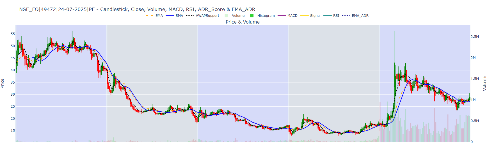

<h1 align="center" style="margin-bottom:0">📊 Market Data Indicator Analysis</h1>

  Developed on sample market data by <b>Debojyoti Dutta</b> to test and validate indicator logics.

  
  
  
  

<h2>✨ Features</h2>
<ul>
  <li><b>Technical Indicators</b>:
    <ul>
      <li>RSI, SMA, EMA, MACD (Signal + Histogram)</li>
      <li>ADR (Average Daily Range)</li>
      <li>VWAP (Volume Weighted Average Price)</li>
      <li>Heikin-Ashi candles &amp; Volume analysis</li>
    </ul>
  </li>
  <li><b>Data Processing</b>: PySpark + Pandas + NumPy</li>
  <li><b>Visualizations</b>: Plotly (interactive) &amp; Matplotlib (static)</li>
</ul>

<h2>📂 Project Structure</h2>
<pre style="background:#0b1021; color:#e6e6e6; padding:12px; border-radius:10px; overflow:auto">
<code>├── README.html          # Project documentation (this file)
├── dataGenerator.py     # Script to generate sample market data
├── index.html           # Interactive visualization (hosted output)
└── requirements.txt     # Python dependencies</code>
</pre>

<h2>🚀 Getting Started</h2>

<ol>
  <li><b>Clone the repository</b></li>
</ol>
<pre><code>git clone https://github.com/debojyDutta/dataBricksIndicators.git
cd dataBricksIndicators</code></pre>

<ol start="2">
  <li><b>Install dependencies</b></li>
</ol>
<pre><code>pip install -r requirements.txt</code></pre>

<ol start="3">
  <li><b>Generate Data</b></li>
</ol>
<pre><code>python dataGenerator.py</code></pre>

<ol start="4">
  <li><b>Open Visualization</b></li>
</ol>
<pre><code>open index.html</code></pre>

<h2 align="center">📷 Example Visualization</h2>

  <a href="https://debojydutta.github.io/dataBricksIndicators/" target="_blank" style="text-decoration:none;">
    
     
    
      ⬆️ CLICK HERE TO INTERACT WITH THE LIVE VISUALIZATION ⬆️
    
  </a>

<h2>📌 Notes</h2>
<ul>
  <li>Built for <b>educational and research</b> use on sample market data.</li>
  <li><b>No financial advice</b> is provided by this repository.</li>
</ul>

<h2>👨‍💻 Author</h2>

  Developed by <b>Debojyoti Dutta</b> 
  📧 <a href="debojyotidutta54754@gmail.com">EMAIL Me :></a>

<h2>📜 License</h2>

Licensed under the <a href="LICENSE">MIT License</a>.

